<h1 align="center">Hi 👋 Welcome to my Github profile!</h1>
<h3 align="center">Currently a Data Engineer Associate and an Automation Engineer. Soon to be an AI Expert!</h3>
 
<h2 align="center">LEARNING DIVISIONS</h2>

Here lies all of my learnings and my journey on becoming an AI Expert

```mermaid
mindmap
  root((AI Expert))
    ⚙️ Automation
      {{📜 Scripting}}
      {{🤖 Robotic Process Automation - RPA}}
    🔬 Data Science
      {{📊 Data Analysis}}
      {{🛠️ Data Engineering}}
      {{🪪 Data Governance}}
    📟 Machine Learning
      {{👄 Natural Language Processing - NLP}}
      {{👁️‍🗨️ Computer Vision}}
      {{⌚️ Time Series}}
    🌏 Miscellaneous
      {{⚖️ Ethics}}
      {{🌨️ Cloud}}
```

## ⚙️ Automation

### 📜 Scripting
Helps to make sure to lessen repititive tasks and provide an easier workflow

### 🤖 Robotic Process Automation (RPA)
Uses tools to provide automation

## 🔬 Data Science

### 📊 Data Analysis
Without understanding data, it's hard to use them

### 🛠️ Data Engineering
Ensures that data will be properly transformed and stored

### 🪪 Data Governance
Data should have standards and policies for usage

## 📟 Machine Learning

### 👄 Natural Language Processing
Focuses on enabling machines to understand human language

### 👁️‍🗨️ Computer Vision
Deals with enabling computers to process images or videos

### ⌚️ Time Series
Involves analyzing data points based on time in order to detect trends or forecast values

## 🌏 Miscellaneous

### ⚖️ Ethics
Ensures to be literate in the field of Data and AI, and to know how to manage them properly.

### 🌨️ Cloud
Makes data and AI models available in public or running 24/7

# CONTENTS
My Github profile is divided into three parts:

## 🏅 Certification
Preparation, collection, and notes for all of the certifications that I'm trying and I've taken

### Exam

### Training

## 💪 Practical
Application of all my learnings like big or small projects

### Competition
1. [2023 Kaggle AI Report](https://github.com/Dixboi/AI-Expert/tree/main/Practical/Projects/2023%20Kaggle%20AI%20Report)

### Pinned Projects
1. [Philippine Earthquakes](https://github.com/Dixboi/AI-Expert/tree/main/Practical/Projects/PH%20Earthquakes)

### Personal Projects
**SOON!**

### 🧠 Theoretical
Collection of all the resources that help me to understand my target fields

# How to reach me
📫 Email: **raimondextervinluan@gmail.com**

